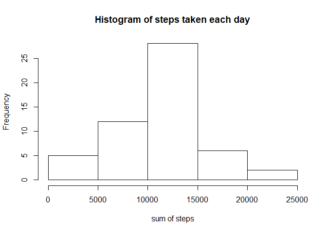

## Loading and preprocessing the data

 Firstly, we read data and check it.

```r
dataset<-read.csv("activity.csv")
```

## What is mean total number of steps taken per day?

For this questioin, we group the data by day and store it as d_data, then plot the histogram of the total number of steps taken each day.  

We applied dplyr package to help us.


```r
library(dplyr)
```

```
## 
## Attaching package: 'dplyr'
```

```
## The following objects are masked from 'package:stats':
## 
##     filter, lag
```

```
## The following objects are masked from 'package:base':
## 
##     intersect, setdiff, setequal, union
```

```r
d_data <- group_by(dataset,date)
for_plot<-summarise(d_data,total=sum(steps))
hist(for_plot$total,main = "Histogram of steps taken each day",xlab = "sum of steps")
```

<!-- -->
and we calculate the mean and median. 
The mean of steps taken each day is as follow table. 

```r
library(dplyr)
d_data%>% summarise(mean(steps,na.rm = TRUE))
```

```
## # A tibble: 61 x 2
##    date       `mean(steps, na.rm = TRUE)`
##    <fct>                            <dbl>
##  1 2012-10-01                     NaN    
##  2 2012-10-02                       0.438
##  3 2012-10-03                      39.4  
##  4 2012-10-04                      42.1  
##  5 2012-10-05                      46.2  
##  6 2012-10-06                      53.5  
##  7 2012-10-07                      38.2  
##  8 2012-10-08                     NaN    
##  9 2012-10-09                      44.5  
## 10 2012-10-10                      34.4  
## # ... with 51 more rows
```
The median of steps taken each day is as follow table. 

```r
d_data%>% summarise(median(steps,na.rm = TRUE))
```

```
## # A tibble: 61 x 2
##    date       `median(steps, na.rm = TRUE)`
##    <fct>                              <dbl>
##  1 2012-10-01                            NA
##  2 2012-10-02                             0
##  3 2012-10-03                             0
##  4 2012-10-04                             0
##  5 2012-10-05                             0
##  6 2012-10-06                             0
##  7 2012-10-07                             0
##  8 2012-10-08                            NA
##  9 2012-10-09                             0
## 10 2012-10-10                             0
## # ... with 51 more rows
```

## What is the average daily activity pattern?

We plot the 5-minumte interval and the average number of steps taken, averaged across all days.

```r
time_interval<- aggregate(steps ~interval,d_data,mean)
plot(time_interval$steps,type = "l",main = "Time interval",
     xlab = "5-minute interval",
     ylab = "Averaged Steps")
```

<!-- -->
We also interested about the maximum number of steps across all the days in the dataset. 

```r
time_interval[which.max(time_interval$steps),]$steps
```

```
## [1] 206.1698
```
The maximum number od steps is 206.1698.


## Imputing missing values

The total number of missing values in the dataset is:

```r
sum(is.na(dataset))
```

```
## [1] 2304
```
To imputing missing values, we devise a strategy for missing values by replace it by mean for 5- minute interval.


```r
new<-dataset
for(i in 1:nrow(new)){
        if(is.na(new$steps[i])){
                value<-new$interval[i] #find the na location
                s_value<-time_interval[time_interval$interval==value,]#find the interval value
                new$steps[i]<-s_value$steps#replace it
        }
}
```

After imputing, we hav new dataset called "new", to check the new dataset, we plot histogram and check the mean and median of total number of steps taken by per day.

```r
d_data <- group_by(new,date)
for_plot<-summarise(d_data,total=sum(steps))
hist(for_plot$total,main = "Histogram of steps taken each day",xlab = "sum of steps")
```

<!-- -->
The mean is as follow table.

```r
d_data%>% summarise(mean(steps))
```

```
## # A tibble: 61 x 2
##    date       `mean(steps)`
##    <fct>              <dbl>
##  1 2012-10-01        37.4  
##  2 2012-10-02         0.438
##  3 2012-10-03        39.4  
##  4 2012-10-04        42.1  
##  5 2012-10-05        46.2  
##  6 2012-10-06        53.5  
##  7 2012-10-07        38.2  
##  8 2012-10-08        37.4  
##  9 2012-10-09        44.5  
## 10 2012-10-10        34.4  
## # ... with 51 more rows
```
The median of steps taken each day is as follow table. 

```r
d_data%>% summarise(median(steps))
```

```
## # A tibble: 61 x 2
##    date       `median(steps)`
##    <fct>                <dbl>
##  1 2012-10-01            34.1
##  2 2012-10-02             0  
##  3 2012-10-03             0  
##  4 2012-10-04             0  
##  5 2012-10-05             0  
##  6 2012-10-06             0  
##  7 2012-10-07             0  
##  8 2012-10-08            34.1
##  9 2012-10-09             0  
## 10 2012-10-10             0  
## # ... with 51 more rows
```

## Are there differences in activity patterns between weekdays and weekends?

we create a new factor variable in the datset called weekday, which with toe levels-"weekday", and "weekend"

```r
Sys.setlocale("LC_TIME", "English")
```

```
## [1] "English_United States.1252"
```

```r
new<-mutate(new, weekday=weekdays(as.Date(new$date)))
for(i in 1:nrow(new)){
        if(new[i,]$weekday == "Sunday"|new[i,]$weekday == "Saturday"){
                new[i,]$weekday<-"weekend"
        }else(new[i,]$weekday<-"weekday")
}  
```
Then we plot the time series plot.

```r
library(ggplot2)
df_by_interval<-aggregate(steps ~ interval + weekday,new,sum)
qplot(interval, 
      steps, 
      data = df_by_interval, 
      type = 'l', 
      geom=c("line"),
      xlab = "Interval", 
      ylab = "Number of steps", 
      main = "") +
        facet_wrap(~ weekday, ncol = 1)
```

```
## Warning: Ignoring unknown parameters: type
```

<!-- -->
